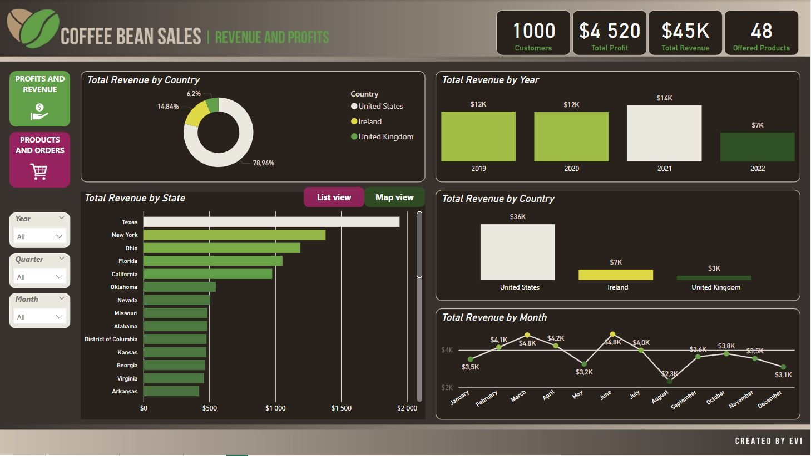
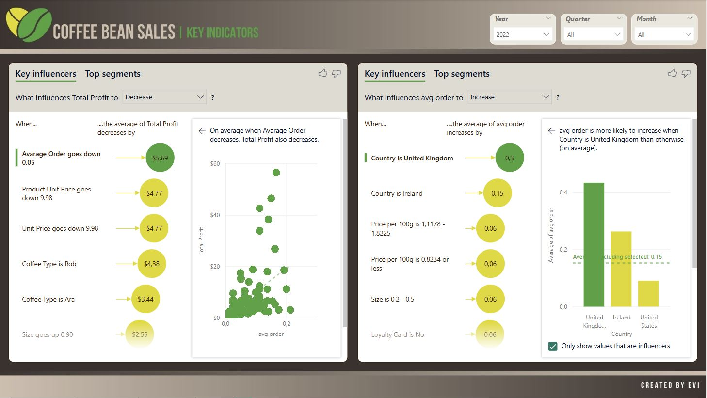

#### *Technical Skills: Excel, Power BI, Canva*
## Project Objective: 
This project aims to conduct a comprehensive sales trend analysis for a coffee bean shop, focusing on identifying the most and least profitable products, detecting periods of increased and decreased sales on a weekly, monthly, and yearly scale, and determining the highest order volumes based on demographics and product preferences. The main objective of this project is to analyze coffee bean sales and profitability trends to optimize business performance. By examining sales distribution across countries, states, and product categories, the project aims to identify key markets and growth opportunities. A focus is placed on understanding seasonal fluctuations and purchasing behavior to develop effective marketing and pricing strategies. Additionally, the project seeks to enhance profitability by optimizing the product portfolio, increasing average order value, and improving sales in underperforming regions. The findings will guide strategic decisions, such as expanding in high-potential markets like Ireland and refining promotional efforts during low-sales periods. By leveraging data-driven insights, the project aims to maximize revenue, improve profit margins, and strengthen the company's market position.

## Dataset Involved:
The project is based on a set of data published on the Kaggle platform containing coffee information about customers, orders and offered products. 
<B>*Data source:*</B> <a href="https://www.kaggle.com/datasets/saadharoon27/coffee-bean-sales-raw-dataset">https://www.kaggle.com/datasets/saadharoon27/coffee-bean-sales-raw-dataset</a>

## Data Visualization:
Below visuals have been made in Power BI desktop and describing results gathered from the dataset: 
*Coffee Bean Sales - Revenues and Profits:*

*Coffee Bean Sales - Products and Orders:*

*Coffee Bean Sales - Key Indidators:*

## Key Insights:  
#### Derived from the data analysis presented in the reports the analysis covers sales, profitability, sesonality and growth opportunities in different markets.
#### 1. The United States is the dominant sales market (78.96% share)
  - The U.S. accounts for 78.96% of total revenue, while Ireland (14.84%) and the United Kingdom (6.2%) generate significantly lower values.
      
  - This suggests that the company should continue expanding in the U.S. market while also considering strategies to grow in Europe.         
#### 2. Key U.S. states – Texas and New York lead in sales
  - Texas generates the highest revenue, followed closely by New York, Ohio, and Florida.
  - Focusing on these states can yield higher profits, while also exploring potential growth in underperforming regions.
#### 3. The highest sales occur in the first quarter of the year
  - The highest revenue is generated in March ($4.8K), February ($4.2K), and January ($3.5K).
  - There is a significant drop in August ($2.3K), indicating seasonal demand fluctuations – promotional campaigns and discounts during this period could be beneficial.
#### 4. Profitability by product – higher-priced variants sell best
  - Products labeled "2.5" generate the highest revenue and profits, suggesting that customers are willing to pay more for larger packages or premium products.
  - A premium pricing strategy and loyalty bundles could further increase sales for these products.
#### 5. Orders are concentrated at the beginning of the week
  - The highest number of orders is placed on Mondays (150) and Tuesdays (151), while Thursdays and Fridays show lower activity.
  - Marketing campaigns and promotions should be aligned with these trends, e.g., offering discounts toward the end of the week.
#### 6. Revenue decline in 2022 compared to previous years
  - In 2021, revenue was $14K, whereas in 2022, it dropped to $7K, indicating a significant decline.
  - This may result from changing customer preferences, increased competition, or a lack of effective marketing actions.
#### 7. The least profitable products may require optimization
  - The "0.2" labeled products generate minimal revenue and are among the least profitable.
  - Possible actions: phasing out these products, adjusting pricing strategies, or bundling them with bestsellers.
#### 8. The average order value remains at $45
  - Customers spend an average of $45 per order, which presents an opportunity to increase cart value through: additional discounts for larger purchases, cross-selling and up-selling strategies
    and loyalty programs
#### 9. The U.S. remains the primary focus, but Europe presents a growth opportunity
  - $36K in revenue comes from the U.S., while only $7K from Ireland and $3K from the UK.
  - Expanding marketing efforts in Europe could boost sales, particularly in Ireland, which has a higher share than the UK.
#### 10. Optimizing the product offering could increase profit margins
  - Profitability stands at $4,520 with total revenue of $45K, meaning a margin of approximately 10%.
Possible ways to improve profitability: raising prices for the most frequently purchased products, increasing sales of higher-margin products and reducing operational costs
  <!--## Download the project in .pdf-->

